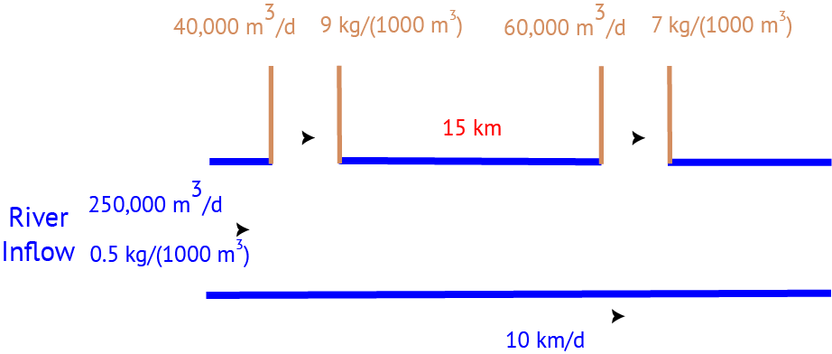

::: {.content-visible when-format="ipynb"}
**Name**:

**ID**:
:::

::: {.callout-important icon=false}
### Due Date

Thursday, 10/03/23, 9:00pm
:::

::: {.content-visible when-format="html"}

:::{.callout-caution}

If you are enrolled in the course, make sure that you use the GitHub Classroom link provided in Ed Discussion, or you may not be able to get help if you run into problems.

Otherwise, you can [find the Github repository here](/hw03).

:::

:::

## Overview

### Instructions


* Problem 1 asks you to implement a model for dissolved oxygen in a river with multiple waste releases and use this to develop a strategy to ensure regulatory compliance.
* Problem 2 asks you to use Monte Carlo simulation to assess how well your strategy from Problem 1 performs under uncertainty.
* Problem 3 (5750 only) asks you to identify where a third discharge should be placed to maintain regulatory compliance.


### Load Environment

The following code loads the environment and makes sure all needed packages are installed. This should be at the start of most Julia scripts.

```{julia}
#| output: false
import Pkg
Pkg.activate(@__DIR__)
Pkg.instantiate()
```

```{julia}
using Random
using Plots
using LaTeXStrings
using Distributions
```

## Problems (Total: 50/60 Points)


::: {.cell .markdown}

### Problem 1 (30 points)

A river which flows at 6 km/d is receiving waste discharges from two sources which are 15 km apart, as shown in @fig-river. The oxygen reaeration rate is 0.55 day^-1^, and the decay rates of CBOD and NBOD are are 0.35 and 0.25 day^-1^, respectively. The river's saturated dissolved oxygen concentration is 10m g/L.

{#fig-river}

If the characteristics of the river inflow and waste discharges are given in @tbl-river, write a Julia model to compute the dissolved oxygen concentration from the first wastewater discharge to an arbitrary distance `d` km downstream. Use your model to compute the maximum dissolved oxygen concentration up to 50km downstream and how far downriver this maximum occurs.

| Parameter | River Inflow | Waste Stream 1 | Waste Stream 2 |
|:---------:|-------------:|---------------:|---------------:|
| Inflow | 100,000 m^3^/d | 10,000 m^3^/d | 15,000 m^3^/d |
| DO Concentration | 7.5 mg/L | 5 mg/L | 5 mg/L |
| CBOD | 5 mg/L | 50 mg/L | 45 mg/L |
| NBOD | 5 mg/L | 35 mg/L | 35 mg/L |
: River inflow and waste stream characteristics for Problem 1. {#tbl-river}

**In this problem**:

* Plot the dissolved oxygen concentration from the first waste stream to 50m downriver. What is the minimum value in mg/L?
* What is the minimum level of treatment (% removal of organic waste) for waste stream 2 that will ensure that the dissolved oxygen concentration never drops below 4 mg/L, assuming that waste stream 1 remains untreated?
* If both waste streams are treated equally, what is the minimum level of treatment (% removal of organic waste) for the two sources required to ensure that the dissolved oxygen concentration never drops below 4 mg/L?
* Suppose you are responsible for designing a waste treatment plan for discharges into the river, with a regulatory mandate to keep the dissolved oxygen concentration above 4 mg/L. Discuss whether you'd opt to treat waste stream 2 alone or both waste streams equally. What other information might you need to make a conclusion, if any?

:::

::: {.cell .markdown}
### Problem 2 (20 points)

Suppose that it is known that the DO concentrations at the river inflow and the CBOD and NBOD of the two waste streams can vary with a standard deviation of $\pm$ 10% from the baseline level used in Problem 1. For this problem, assume that the CBOD and NBOD of each waste stream change by the same percentage value, but are independent of changes to the other waste stream and to the inflow DO. You can assume that the percentage changes are represented by a normal distribution (**note**: make sure the resulting values are physically plausible!)

**In this problem**:

* Use Monte Carlo simulation to compute the expected minimum dissolved oxygen concentration and its 95% confidence interval with the treatment strategy that you selected in Problem 1. 
* Using your Monte Carlo simulations, what is the probability that the river fails to remain compliant with the regulatory standard? Is this what you expected? Why or why not?

:::

::: {.cell .markdown}
### Problem 3 (10 points)

**This problem is only required for students in BEE 5750**.

A factory is planning a third wastewater discharge into the river downstream of the second plant. This discharge would consist of 5 m^3^/day of wastewater with a dissolved oxygen content of 4.5 mg/L and CBOD and NBOD levels of 50 and 45 mg/L, respectively.

**In this problem**:

* Assume that the treatment plan you identified in Problem 1 is still in place for the existing discharges. If the third discharge will not be treated, under the original inflow conditions (7.5 mg/L DO), how far downstream from the second discharge does this third discharge need to be placed to keep the river concentration from dropping below 4 mg/L?
:::


::: {.cell .markdown}
## References

List any external references consulted, including classmates.
:::
